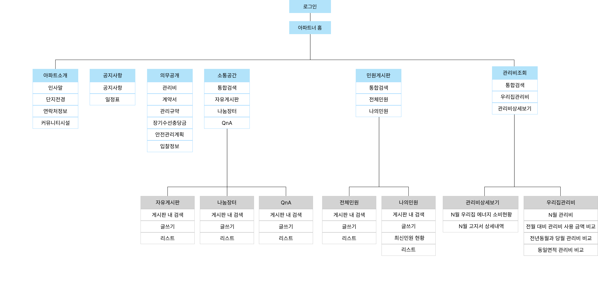
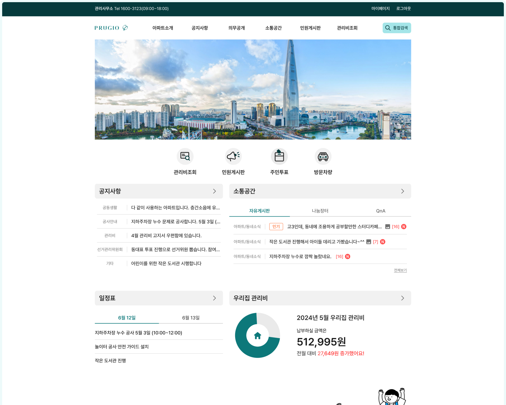
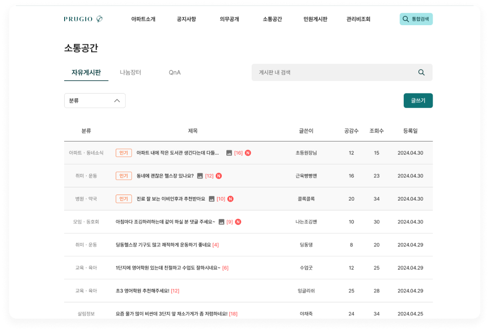
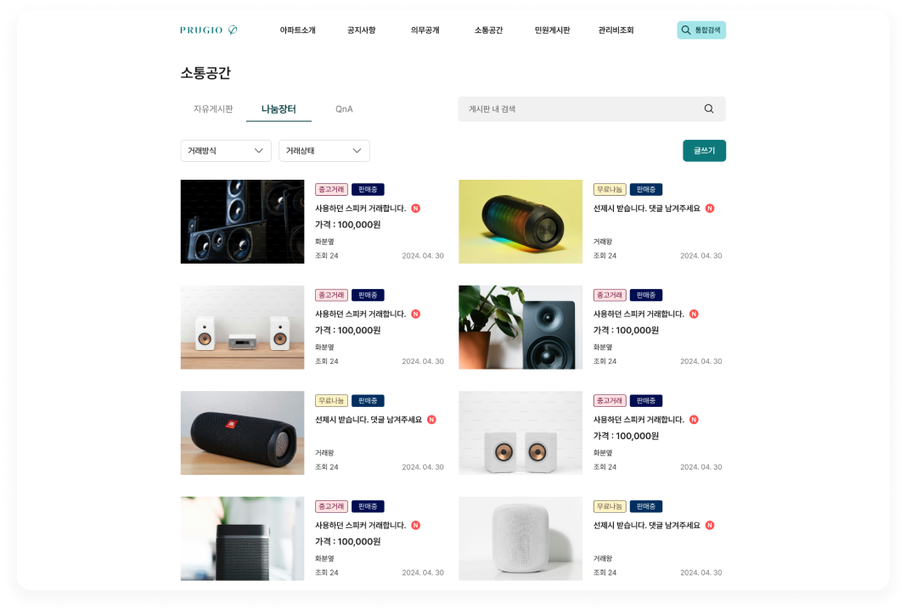
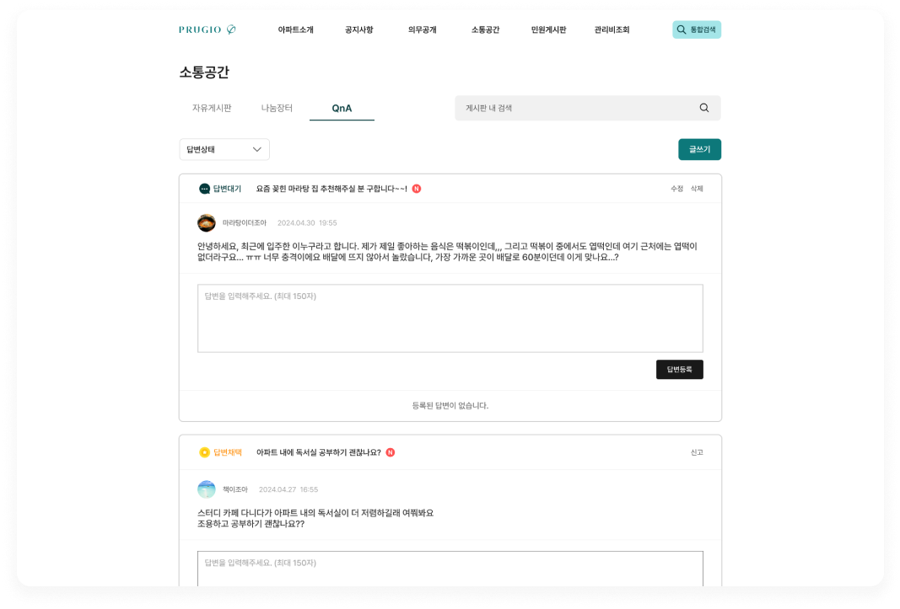
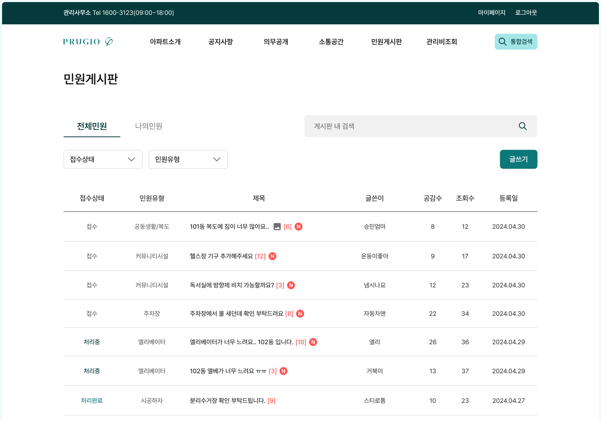
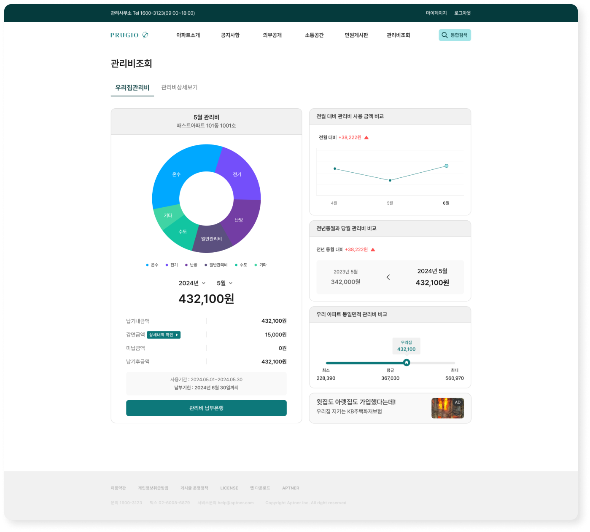
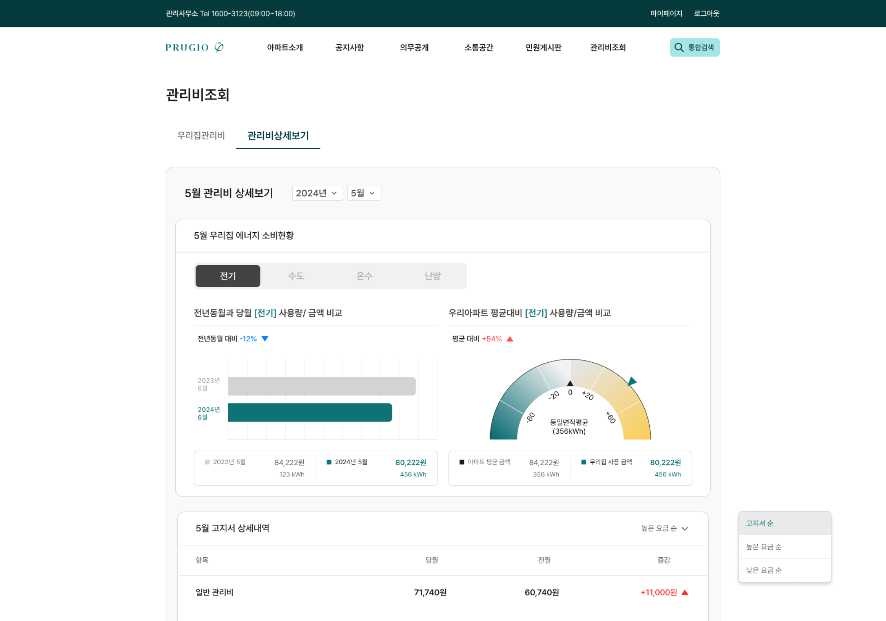
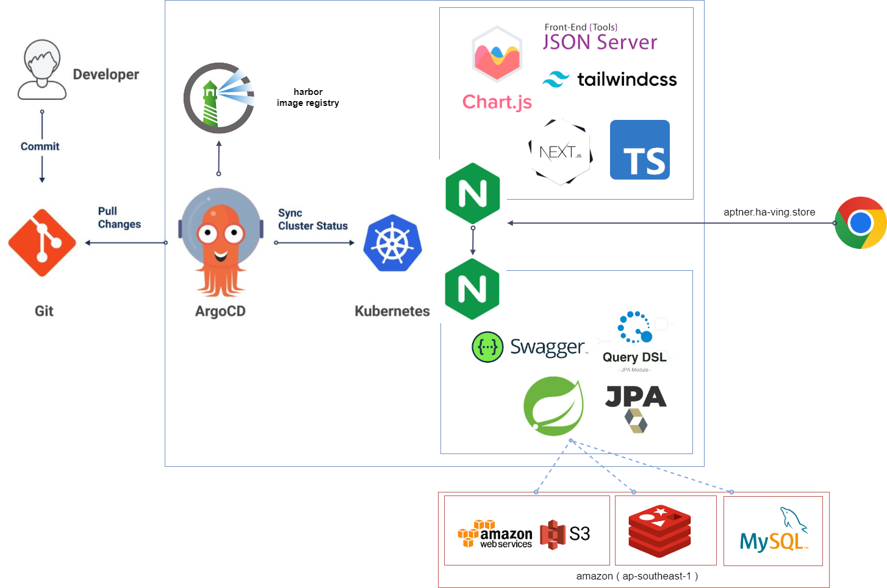

[](https://github.com/fastcampus-711/backend/actions/workflows/build.yaml)

# :office: [입주민 생활 편의 서비스, 아파트너](https://aptner.ha-ving.store)

### :bulb: 입주민들 간 자유로운 소통
* 입주민을 위한 목적에 맞는 소통 공간 ( 자유게시판, Qna, 나눔게시판, 공지사항, 민원게시판 )
* 비밀글, 대댓글 기능을 통한 1:1 소통

### :bulb: 매달 쌓이는 공과금 우편을 한손에!
* 아파트 관련 정보와 세세한 공과금 항목을 전년,전월,전일로 한 눈에 확인 가능
* 우리 아파트 평균 관리비 관리 기능
* 우리 집 평균 관리비 관리 기능
* 전기,가스,수도를 동일 평수내 비교 기능

## Youtube Overview
[](https://youtu.be/rdb52JLeFT8?feature=shared)

## 주요 페이지









## 인프라


## :hammer: 사용한 기술 스택
- 
- 
    - 
    - 
    - 
- 
- 
- 
- 
- 

## 기술 사용
| 기술                          | 내용                  |
|-----------------------------|---------------------|
| ARGO CI/CD                  | 지속적 배포 지원           |
| QueryDSL                    | Menu, Category API 사용 |
| Spring Doc (Swagger3.0)     | API 문서              |
| Access Token, Refresh Token | Token 생성            | 
| Redis                       | Token 저장소 DB로 사용    |

## :clipboard: API 및 기술 문서 
- [API문서](https://docs.google.com/document/d/1LcSW8h3jjbClEtpAeo95xwRoJ2d1nFeL3XP7Qbyfbi4/edit?usp=sharing)
- [SWAGGER](https://711.ha-ving.store/swagger-ui/index.html)
- [UI](https://aptner.ha-ving.store)
- [FIGMA](https://www.figma.com/design/vYdE7q4wdbdNTgpf7w07ep/%ED%8C%8C%EC%9D%B4%EB%84%90_7%EC%A1%B0-%ED%94%BC%EA%B7%B8%EB%A7%88?node-id=37-3&t=B7ypkS7erlHYCbr3-0)

## :earth_asia: ERD

<br>


## 👨‍👩‍👧‍👦 팀원 소개 & 팀원 역할

|이름| 역할 | 분담                                                          | 기술                              | Github                                          
|------|---------------------|----|-------------------------------------------------------------|-------------------------------------------------| 
|유연수 | 팀장 | Qna(민원 게시판), Comments(댓글) API 담당, Infra 담당 | SpringSecurity, JWT, Docker, S3 | [having-dlrow](https://github.com/having-dlrow) |
|민장규| 팀원 | BOARD(게시판), 관리비 API 담당                                      | Spring Framework, JPA, Generic  | [MinKevin](https://github.com/MinKevin)         |
|이진혁| 팀원 | CATEGORY(분류),인증, 신고, 인기글 API 담당                             | Spring Security, JPA            | [HARIBO033](https://github.com/HARIBO033)       | 

## :calendar: 개발 기간
5월 1일 ~ 6월15일

## :octocat: 개발 RULE
### 브랜치 Rule (Git Flow)
```
    - PROD 배포  :   master
    - QA 배포    :   develop
    - 개발       :   feature/#{issue-no}
```

### [개발 Rule](https://github.com/fastcampus-711/backend/wiki/Spring-Convention)
```
    1. 변수명, 짧고 간결한 단어 선택이 어렵다면, 길게 변수 및 함수를 쓰고. 코드 리뷰에 언급 한다.
    2. TDD, @Display 한글로 테스트 주제를 쓴다.
    3. TDD, 비지니스 로직은 반드시 TDD를 남긴다.
    4. if(!status.isNormal()) 가능 하다.
    5. Wrapping형 보다, 기본 자료형을 고려하자.
```
